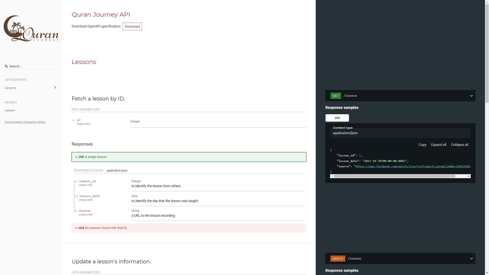

# Docs

The steps to document code are simple:
1. Add inline comments that describe the endpoints or schemas using OAS.
2. execute `sh run.sh` to process the docs and serve them on localhost. 

It's that simple.

We are using [OAS 2.0](https://swagger.io/docs/specification/2-0) to document our code and [redoc](https://github.com/Redocly/redoc) to format it into html. This process has already partially been automated and we are using some time saving tools along the way. Documentation, therefore, should be easy and therefore highly encouraged.

What inline documentation looks like (focus on the comments, not the code):

Notice how little effort that comment is. You are able to document the endpoint so that other people can see it in an easy and visually appealing way with less than 20 lines!

Here's how that inline documentation looks after it's been processed with `run.sh`:

To see how you can document the code yourself in more detail, take a look at the files inside of the model and routes folders (particularly lesson.js). Notice that the models are documented slightly differently from how the routes are documented. After running `sh run.sh`, you can see the documentation at `http://localhost/redoc-static.html`.

You'll also see that an `oas.json` and `redoc-static.html` file have been generated. You can ignore those unless you need to debug something in the documentation process, in which case you can see one of the references below.

Note: The inline documentation is known as [swagger inline documentation](https://github.com/readmeio/swagger-inline). Check that repo to see some instructions on how to use swagger oas inline with the code. It's also a good idea to reference swagger oas yaml formats.

References:
- [petstore redoc html example](https://redocly.github.io/redoc/)
- [petstore yaml example](https://redocly.github.io/redoc/openapi.yaml)
- [redoc "extensions"](https://github.com/Redocly/redoc/blob/master/docs/redoc-vendor-extensions.md#x-logo)